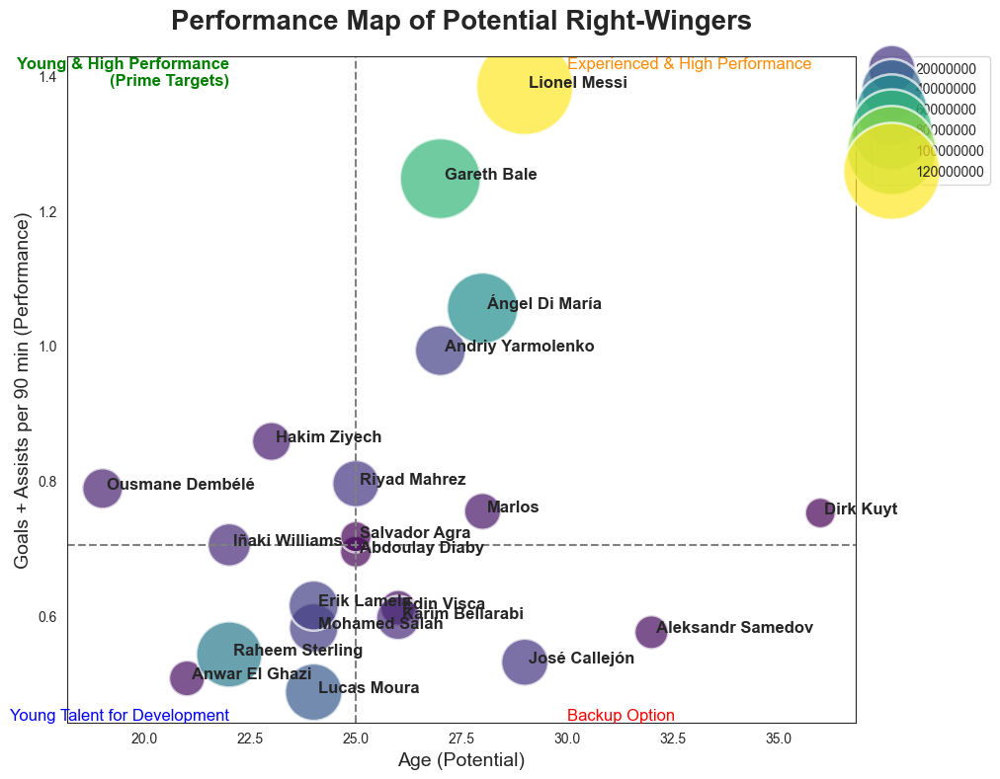
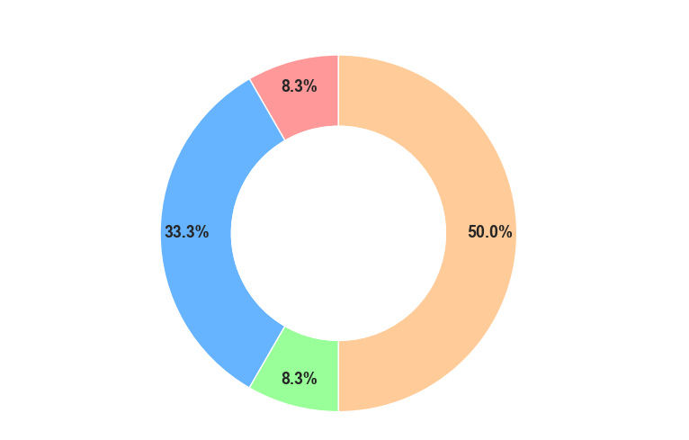
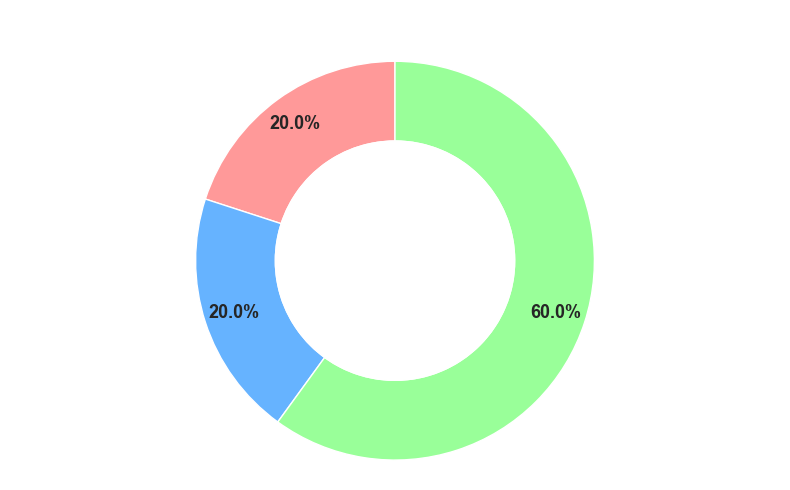
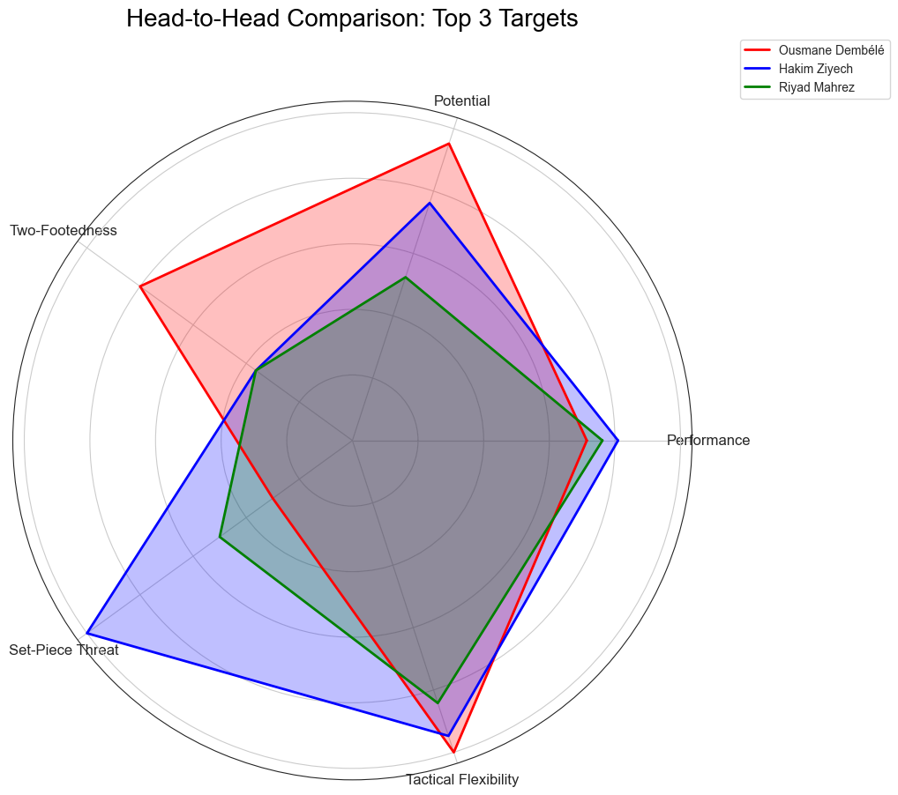

# Data-Driven Football Scouting: A Strategic Analysis of Right-Winger Targets

### A Project for Borussia Dortmund (2016/17 Season)

**Data**: [Football Data from Transfermarkt](https://www.kaggle.com/datasets/davidcariboo/player-scores/data)

## 1. Objective

This project simulates a real-world data analysis task for a top-tier football club. The scenario is the end of the 2015/16 season, where Borussia Dortmund, under Head Coach Thomas Tuchel, faces the critical challenge of replacing key players, most notably the Bundesliga's top creator, Henrikh Mkhitaryan.

The objective is to leverage a comprehensive football dataset to conduct a data-driven scouting process, moving from a broad market analysis to a specific, evidence-backed player recommendation that aligns with the coach's unique tactical philosophy.

## 2. Key Features

* **End-to-End ETL Process:** Data extraction from raw CSV files, cleaning and transformation with Pandas, and loading into a relational MS SQL Server database.
* **Strategic Market Analysis:** A high-level visualization of the European market for right-wingers to identify a shortlist of high-potential, attainable targets.
* **In-Depth Player Dossiers:** Detailed analysis of each shortlisted candidate, breaking down their "Player DNA" across three key areas:
    * **Tactical DNA:** Positional and formational versatility.
    * **Goalscoring DNA:** How and where they score their goals.
    * **Creative DNA:** How they create chances for others.
* **Compelling Storytelling:** A final, data-driven recommendation presented through a series of clear, persuasive visualizations designed for a senior stakeholder (the Head Coach).

## 3. Tech Stack & Tools

* **Language:** Python, SQL (T-SQL)
* **Libraries:** Pandas, Matplotlib, Seaborn, SQLAlchemy
* **Database:** MS SQL Server
* **Tools:** Jupyter Notebook, GitHub, Microsoft PowerPoint

## 4. Methodology

The analysis follows a three-act storytelling structure to guide the decision-making process logically.

### **Act I: The Landscape - Market Analysis**

We start with a broad view of the entire European market for right-wingers. By plotting all available players on a bubble chart comparing their **Performance (G+A per 90)**, **Potential (Age)**, and **Cost (Market Value)**, we can immediately identify different strategic tiers and isolate a high-value "Prime Targets" quadrant.

> *This chart allows us to filter out the noise and focus on a shortlist of young, high-performing, and financially viable players.*

---
### **Act II: The Profile - Player DNA Deep-Dive**

For each shortlisted candidate, we build a detailed dossier. This involves analyzing their playing style through specialized charts:
* **Tactical DNA (Heatmap/Sunburst):** Reveals a player's positional and formational versatility.
* **Goalscoring & Creative DNA (Donut Charts):** Breaks down *how* a player scores and assists, revealing key traits like two-footedness or set-piece mastery.

 
> *Dembélé's DNA charts revealed his exceptional two-footedness, a key differentiator.*

---
### **Act III: The Verdict - Head-to-Head Comparison**

Finally, we place the top candidates in a direct, multi-faceted comparison using a radar chart. This visualizes their strengths and weaknesses against the core attributes required by the coach (Performance, Potential, Two-Footedness, Set-Piece Threat, Tactical Flexibility).

> *The radar chart provides a definitive visual summary, making the final recommendation clear and easy to understand.*

## 5. Final Recommendation

The analysis concludes that **Ousmane Dembélé** is the optimal transfer target. He is the only candidate who scores at an elite level across nearly every critical attribute: performance, potential, and tactical fit. His rare two-footed ability makes him a unique and unpredictable weapon that perfectly aligns with Coach Tuchel's desire for a fluid, dynamic attack.

